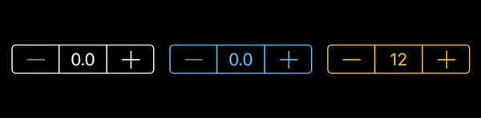
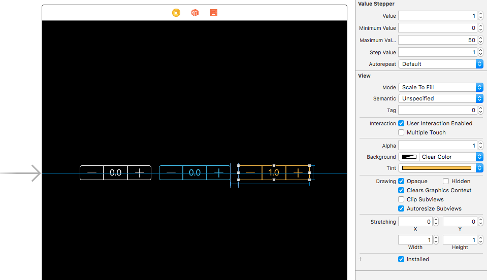

# ValueStepper

[](https://travis-ci.org/BalestraPatrick/ValueStepper)
[](https://github.com/Carthage/Carthage)
[](http://cocoapods.org/pods/ValueStepper)
[](http://cocoapods.org/pods/ValueStepper)
[](http://cocoapods.org/pods/ValueStepper)



## Description
`ValueStepper` is an improved replication of Apple's `UIStepper` object. The problem with `UIStepper` is that it doesn't display the value to the user. I was tired of creating a simple `UILabel` just to show the value in the UI. `ValueStepper` integrates the value in a `UILabel` between the increase and decrease buttons. It's as easy as that.

## Usage
To see it in action, run the example project, clone the repo, and run `pod install` from the `Example` directory first. The example project shows how to set up `ValueStepper` in Storyboard. 

### Storyboard
Drag a `UIView` object and set the class to `ValueStepper` (if needed set the module to `ValueStepper` too). You can now customize all the properties in IB such as the `minimumValue`, `tintColor` and so on. Make sure to set the width to 149 and the height to 29 which are the default values. Create an `@IBAction` on the `ValueChanged` control event to be notified when the value changes.


### Programmatically
```swift
import ValueStepper

let valueStepper: ValueStepper = {
    let stepper = ValueStepper()
    stepper.tintColor = .whiteColor()
    stepper.minimumValue = 0
    stepper.maximumValue = 1000
    stepper.stepValue = 100
    return stepper
}()

override func viewDidLoad() {
    super.viewDidLoad()       
    valueStepper.addTarget(self, action: "valueChanged:", forControlEvents: .ValueChanged)
}

@IBAction func valueChanged1(sender: ValueStepper) {
    // Use sender.value to do whatever you want
}
```

## Customizations
These are the available properties with the relative documentation.

```swift
/// Current value and sends UIControlEventValueChanged when modified.
@IBInspectable public var value: Double = 0.0
    
/// Minimum value that must be the less than the maximum value.
@IBInspectable public var minimumValue: Double = 0.0
    
/// Maximum value that must be greater than the minimum value.
@IBInspectable public var maximumValue: Double = 1.0
    
/// When set to true, the user can tap the label and manually enter a value.
@IBInspectable public var enableManualEditing: Bool = false

/// The value added/subtracted when one of the two buttons is pressed.
@IBInspectable public var stepValue: Double = 0.1
    
/// When set to true, keeping a button pressed will continuously increase/decrease the value every 0.1s.
@IBInspectable public var autorepeat: Bool = true
    
/// Describes the format of the value.
public var numberFormatter: NSNumberFormatter
    
// Default width of the stepper. Taken from the official UIStepper object.
public let defaultWidth = 141.0
    
// Default height of the stepper. Taken from the official UIStepper object.
public let defaultHeight = 29.0
```

## Installation

ValueStepper is available through [CocoaPods](http://cocoapods.org). To install
it, simply add the following line to your `Podfile`:

```ruby
pod 'ValueStepper'
```

You can also use [Carthage](https://github.com/Carthage/Carthage) if you prefer. Add this line to your `Cartfile`.

```ruby
github "BalestraPatrick/ValueStepper"
```
## Requirements
iOS 8.3 and Swift 3.0 are required.

- If you are using Swift 4, use the [swift-4 branch](https://github.com/BalestraPatrick/ValueStepper/tree/swift-4).
- If you are using Swift 3.2, use the [swift-3.2 branch](https://github.com/BalestraPatrick/ValueStepper/tree/swift-3.2).
- If you are using Swift 2.3, use the [swift-2.3 branch](https://github.com/BalestraPatrick/ValueStepper/tree/swift-2.3).

## Author

I'm [Patrick Balestra](http://www.patrickbalestra.com).
Email: [me@patrickbalestra.com](mailto:me@patrickbalestra.com)
Twitter: [@BalestraPatrick](http://twitter.com/BalestraPatrick).

## License

`ValueStepper` is available under the MIT license. See the [LICENSE](LICENSE) file for more info.

Inspired by [GMStepper](https://github.com/gmertk/GMStepper). Thanks to [Gmertk](https://github.com/gmertk) for the interesting and useful related [blog post](http://gmertk.github.io/custom-stepper-part-1).
